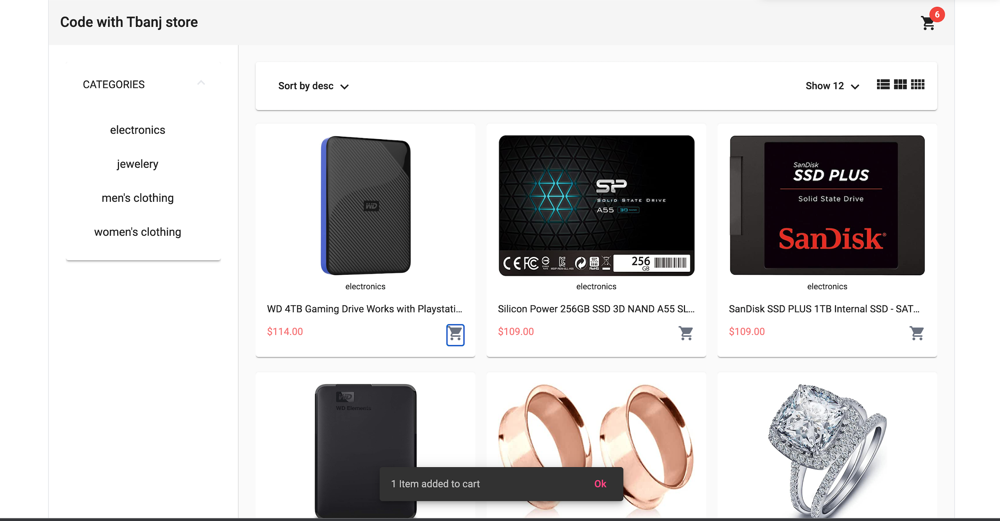
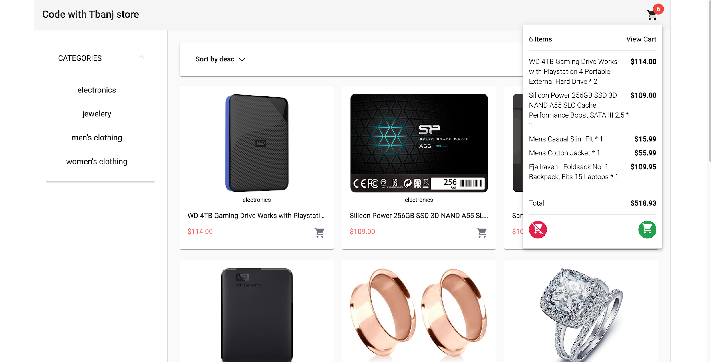
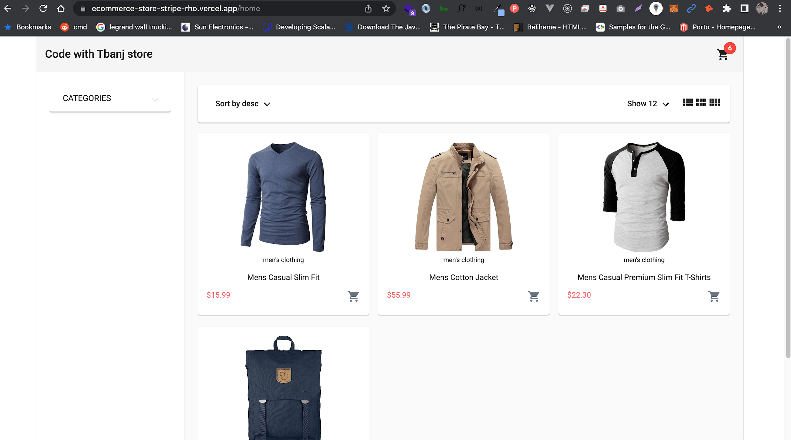
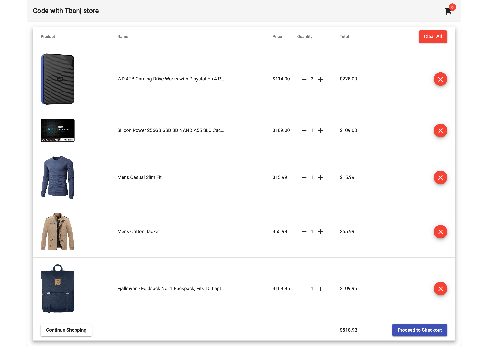
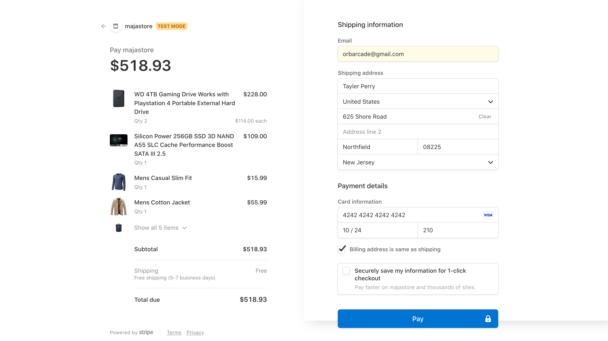

# Proof of Concept(POC) Webshop Integrated with Stripe

This is a web solution which is an ecommerce solution that can be adopted and expanded for sales of electronics and clothes of different genders. It is implemented with Angular version 14, tailwindCss, Angular Material, HTML5 and CSS3.

Database is implemented with firebase.

Payment module is integrated with Stripe.

Live demonstrtion of the application is hosted at
https://ecommerce-store-stripe-rho.vercel.app

# Screenshots

&nbsp;
&nbsp;
&nbsp;
&nbsp;
&nbsp;
&nbsp;

# Author : Alabi Temitope 
